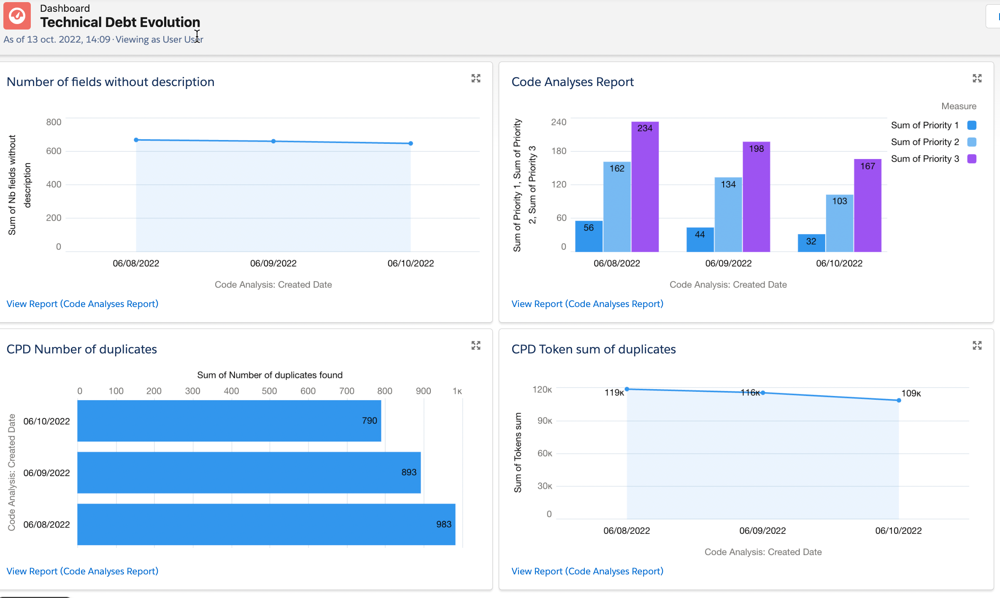

# Apex Code Analysis
This repo contains SObject and shell scripts used to persist code analysis reports summary in Salesforce.


## Disclaimer
Apex Code Analysis is not an official Salesforce product, it has not been officially tested or documented by Salesforce.
## Required packages

- awk
- sed (depending on the OS you're using, you may need to adapt the sed commands to match your OS)
- grep
- jq
## Use case
Sometimes you want to implement static code analysis but the project you're working on already contains some technical debt. If you're running the PMD command on your project, the command exit status will be a failure.

With this framework, you will be able to monitor the technical debt reduction for each deployment, and prevent additional debt to be added.


## How to follow technical debt ?

You can monitor technical debt on the dashboard **Technical Debt Evolution**



## How does it works ?

The pmd rules are configured in the file [custom-apex-rules.xml](./custom-apex-rules.xml)

To run the analysis and compare it to the previous values (or create it for the first check), run the following command:
```sh
. ./help-functions.sh && check_analyses "$orgAlias" "$pmdBinPath"
```

The generated reports are parsed to extract the needed data to insert the SObject.

You can re-use the PMD report to copy it into your staticResource folder to be able to see it in Salesforce after deployment.


## Deploy to Salesforce


Before deploying this project to salesforce, we need to update the some metadata to match with your org and username context
- Report and Dashboard : contains username and must exist in your org.
- CustomHelpMenuSection : contains org url and must be updated with yours.

To do so, you can run the following script to update it.
- "orgAlias" parameter must be replaced by your org alias or username.
- "usernameToUseInReport" parameter must be replaced by the username you want to reference in the report and dashboard.
- "pmdMinimumPriority" Rule priority threshold; rules with lower priority than configured here won't be used.
- "cpdToken" the minimum token length which should be reported as a duplicate.

```sh
. ./help-functions.sh && update_meta_with_org_values "orgAlias" "usernameToUseInReport" "pmdMinimumPriority" "cpdToken"
```


Checkout the repo and deploy it with sfdx:
```sh
sfdx force:source:deploy -p force-app
```